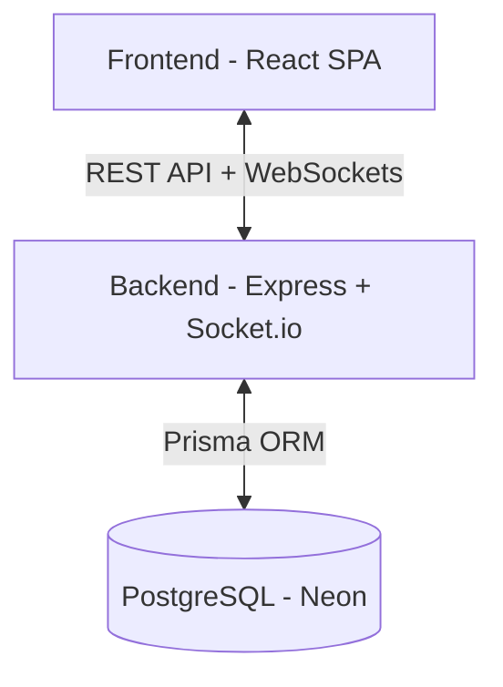

# Lumora

Lumora is a real-time collaborative task management platform designed for teams who need seamless synchronization and a modern workflow. Built with a robust full-stack architecture, it features real-time updates, secure authentication, and a sleek, responsive interface.

## 🚀 Overview

Lumora allows users to create boards, manage task lists, and collaborate with team members in real-time. Whether you're moving tasks across columns or updating descriptions, every change is instantly reflected for all active members on the board.

## ✨ Features

- **Real-Time Collaboration**: Instant updates across all clients using Socket.io.
- **Secure Authentication**: Cookie-based JWT authentication with HTTP-only security.
- **Board Management**: Create, view, and delete boards with member-based access control.
- **Drag & Drop Workflow**: Reorder tasks and move them between lists seamlessly.
- **Activity Tracking**: Comprehensive audit logs for every action on a board.
- **Optimistic UI**: Snappy interface that updates immediately while syncing in the background.
- **Rate Limiting & Security**: Protected against brute-force and common web vulnerabilities.
- **Performance Optimized**: Database indexing, pagination, and efficient Prisma queries.

## 🛠 Tech Stack

### Frontend
- **React 18** + **Vite**
- **TypeScript**
- **Zustand** (State Management)
- **React Query** (Server State)
- **Tailwind CSS** (Styling)
- **Socket.io Client** (Real-time)
- **Lucide React** (Icons)

### Backend
- **Node.js** + **Express**
- **TypeScript**
- **Prisma 7** + **Neon Adapter** (PostgreSQL)
- **Socket.io** (WebSockets)
- **Zod** (Validation)
- **JWT** (Authentication)
- **Jest** (Testing)

---

## 🏗 Architecture Overview

### System Architecture


### 🔄 Real-Time Strategy
Lumora uses a room-based strategy for real-time updates. When a user opens a board, they join a socket room specific to that board ID. Events like `task_created`, `task_updated`, or `list_deleted` are emitted only to the members of that specific room, ensuring scalability and data privacy.

### 🗄 Database Design
The schema is optimized for relational integrity and query performance:
- **Users**: Core user profiles.
- **Boards**: Collections of lists and tasks.
- **BoardMembers**: Join table for many-to-many relationship between Users and Boards with role-based access.
- **Lists**: Ordered vertical containers within a board.
- **Tasks**: Individual units of work with positioning and labels.
- **Activity**: History logs linked to boards and users.

*Indexing is applied on foreign keys and frequently searched fields (like task titles and board IDs) to ensure sub-millisecond query execution.*

### 🔐 Security Strategy
- **JWT in HTTP-only Cookies**: Prevents XSS attacks from stealing tokens.
- **CSRF Protection**: SameSite cookie attributes and CORS validation.
- **Input Validation**: Strict schema validation using Zod for all API requests.
- **Rate Limiting**: Protects authentication and expensive endpoints from abuse.
- **Sanitization**: Automatic HTML sanitization to prevent injection attacks.

---

## 📡 API Documentation

### 🔐 Auth
- `POST /api/auth/signup`: Create a new account.
- `POST /api/auth/login`: Authenticate and receive session cookie.
- `POST /api/auth/logout`: Clear session cookie.
- `GET /api/auth/me`: Get current authenticated user details.

### 📋 Boards
- `GET /api/boards?page=1&limit=10`: List boards with pagination.
- `POST /api/boards`: Create a new board.
- `GET /api/boards/:id`: Get detailed board view with lists and tasks.
- `DELETE /api/boards/:id`: Archive/Delete a board.
- `GET /api/boards/:id/activity`: Fetch activity logs for a specific board.

### 📑 Lists
- `POST /api/lists`: Create a list on a board.
- `PATCH /api/lists/:id`: Update list title or position.
- `DELETE /api/lists/:id`: Remove a list and its tasks.

### 📝 Tasks
- `GET /api/tasks?search=...`: Search tasks across boards.
- `POST /api/tasks`: Create a task in a list.
- `PATCH /api/tasks/:id`: Update task content, position, or move between lists.
- `DELETE /api/tasks/:id`: Remove a task.

---

## 📦 Installation

### Backend
1. `cd server`
2. `npm install`
3. Create `.env` from `.env.example` and add your database URL.
4. `npx prisma generate`
5. `npm run dev`

### Frontend
1. `cd client`
2. `npm install`
3. Create `.env` from `.env.example`.
4. `npm run dev`

## 🧪 Running Tests
```bash
# Backend tests
cd server
npm run test

# Frontend tests (if applicable)
cd client
npm run test
```

## 🏁 Production Notes
- **Scalability**: The backend is stateless, allowing for horizontal scaling.
- **Prisma 7**: Leverages the latest Prisma features for Neon serverless databases.
- **WebSocket Scaling**: Ready for Redis adapter integration for multi-node socket deployments.
