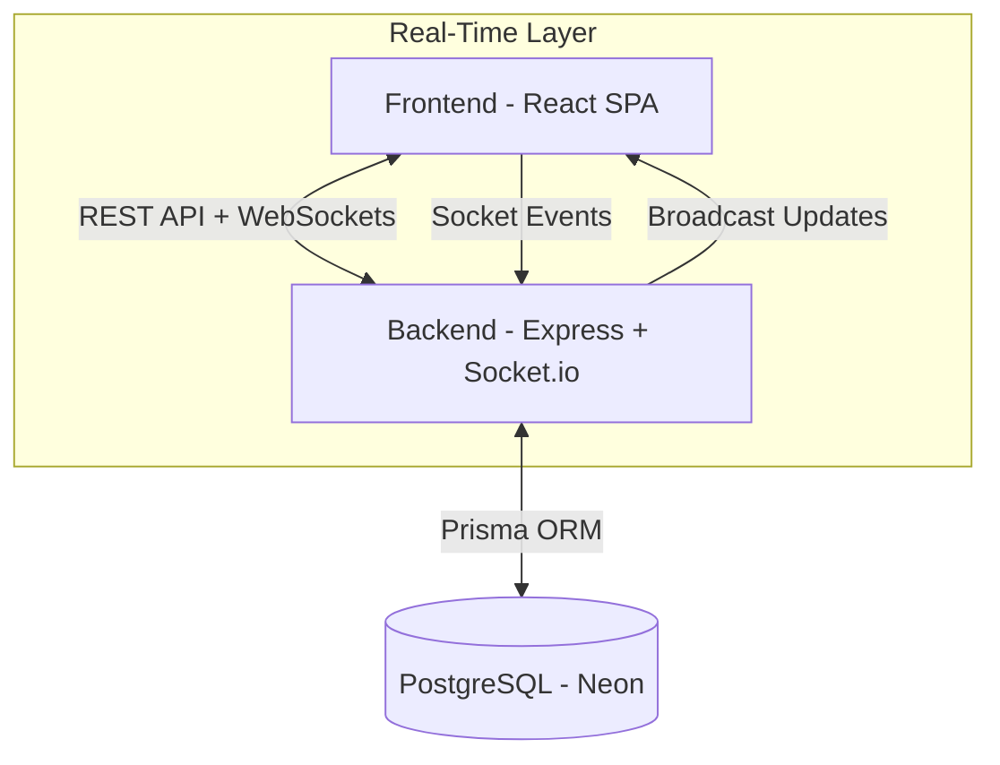

# Lumora


Lumora is a powerful, real-time collaborative task management platform designed for modern teams. Built with a robust full-stack architecture, it ensures seamless synchronization, secure authentication, and a premium user experience.

## 🚀 Overview

Lumora empowers users to create boards, manage task lists, and collaborate with team members instantaneously. With features like drag-and-drop task management, real-time updates, and comprehensive activity tracking, Lumora serves as a centralized hub for productivity.

## ✨ Features

- **Real-Time Collaboration**: Instant updates across all connected clients using Socket.io.
- **Secure Authentication**: Robust cookie-based JWT authentication with HTTP-only security.
- **Board Management**: Create, organize, and manage multiple boards with granular access control.
- **Drag & Drop Workflow**: Intuitive drag-and-drop interface for reordering tasks and moving them between lists.
- **Activity Tracking**: Detailed audit logs for every action taken on a board.
- **Optimistic UI**: responsive interface that updates immediately for a smooth user experience.
- **Dashboard Analytics**: insightful statistics on task completion and project progress.
- **Responsive Design**: Fully responsive UI built with Tailwind CSS and Shadcn UI.

##  Tech Stack

### Frontend
- **Framework**: React 18 + Vite
- **Language**: TypeScript
- **State Management**: Zustand
- **Server State**: TanStack Query (React Query)
- **Styling**: Tailwind CSS + Shadcn UI
- **Real-time**: Socket.io Client
- **Drag & Drop**: @dnd-kit
- **Icons**: Lucide React

### Backend
- **Runtime**: Node.js
- **Framework**: Express.js
- **Language**: TypeScript
- **Database**: PostgreSQL (via Neon)
- **ORM**: Prisma 7
- **Real-time**: Socket.io
- **Validation**: Zod
- **Authentication**: JWT (JSON Web Tokens)
- **Security**: Helmet, CORS, Rate Limiting, XSS Sanitzation

## 📂 Project Structure

```bash
lumora/
├── client/                     # Frontend Application
│   ├── src/
│   │   ├── components/         # UI Components
│   │   │   ├── board/          # Board-specific components
│   │   │   ├── layout/         # Layout wrappers (Sidebar, etc.)
│   │   │   ├── modals/         # Global modals
│   │   │   ├── ui/             # Shadcn UI primitives (Button, Input, etc.)
│   │   │   ├── BoardCard.tsx   # Dashboard board item
│   │   │   └── NavLink.tsx     # Navigation helper
│   │   ├── hooks/              # Custom React Hooks
│   │   ├── pages/              # Route Pages
│   │   │   ├── Activity.tsx    # Global activity feed
│   │   │   ├── AssignedToMe.tsx# User's assigned tasks
│   │   │   ├── Board.tsx       # Main kanban board view
│   │   │   ├── CreatedByMe.tsx # Boards created by user
│   │   │   ├── Dashboard.tsx   # Main dashboard
│   │   │   ├── Login.tsx       # Auth login
│   │   │   ├── NotFound.tsx    # 404 page
│   │   │   ├── Settings.tsx    # User settings
│   │   │   └── Signup.tsx      # Auth signup
│   │   ├── services/           # API service layers
│   │   ├── store/              # Zustand state stores
│   │   └── types/              # TypeScript definitions
│   └── ...
├── server/                     # Backend API & WebSocket Server
│   ├── src/
│   │   ├── config/             # Configuration
│   │   │   ├── db.ts           # Database connection
│   │   │   └── env.ts          # Environment variables
│   │   ├── middlewares/        # Express Middlewares
│   │   │   ├── auth.middleware.ts
│   │   │   ├── error.middleware.ts
│   │   │   ├── rateLimit.middleware.ts
│   │   │   └── validate.middleware.ts
│   │   ├── modules/            # Feature Modules (Routes, Controllers, Services)
│   │   │   ├── activity/       # Activity logging logic
│   │   │   ├── auth/           # Authentication logic
│   │   │   ├── board/          # Board management
│   │   │   ├── dashboard/      # Statistics
│   │   │   ├── list/           # List management
│   │   │   └── task/           # Task management
│   │   ├── socket/             # WebSocket Handling
│   │   │   ├── socket.ts       # Main socket initialization
│   │   │   └── socket.utils.ts # Socket event helpers
│   │   ├── utils/              # Shared Utilities
│   │   │   ├── jwt.ts          # Token generation
│   │   │   ├── logger.ts       # Logging utility
│   │   │   └── permissions.ts  # Role-based access control
│   │   └── app.ts              # Express App setup
│   └── prisma/                 # Database Schema & Migrations
└── ...
```

## 🏗 Architecture Overview

### System Architecture


### 🔄 Real-Time Strategy
Lumora utilizes a **room-based architecture** for real-time updates.
1.  **Connection**: When a user connects, they are authenticated via their session cookie.
2.  **Joining Rooms**: Upon entering a board, the client emits a `join_board` event with the `boardId`.
3.  **Event Broadcasting**: Actions like `task_moved` or `list_created` are processed by the server and then emitted specifically to that board's room.
4.  **Optimistic Updates**: The frontend updates the UI immediately while waiting for server confirmation, ensuring a snappy experience.

### 🗄 Database Design
The database schema is designed for relational integrity and efficiency:
-   **Users**: Stores authentication and profile data.
-   **Boards**: The top-level container for projects.
-   **Lists**: Vertical columns within a board (e.g., "To Do", "In Progress").
-   **Tasks**: Individual items within lists, supporting ordering and assignment.
-   **BoardMembers**: Manages many-to-many relationships between Users and Boards with roles.
-   **Activity**: an append-only log of all actions for audit trails.

## 📡 API Documentation

### Auth
| Method | Endpoint | Description |
| :--- | :--- | :--- |
| `POST` | `/api/auth/signup` | Register a new user account. |
| `POST` | `/api/auth/login` | Authenticate user and set session cookie. |
| `POST` | `/api/auth/logout` | Clear session cookie. |
| `GET` | `/api/auth/me` | Get currently authenticated user details. |
| `PATCH` | `/api/auth/me` | Update user profile information. |
| `POST` | `/api/auth/change-password` | Change user password. |
| `GET` | `/api/auth/users` | Search for users by name or email. |

### Boards
| Method | Endpoint | Description |
| :--- | :--- | :--- |
| `GET` | `/api/boards` | Get all boards for the current user. |
| `POST` | `/api/boards` | Create a new board. |
| `GET` | `/api/boards/:id` | Get details of a specific board. |
| `DELETE` | `/api/boards/:id` | Delete a board. |
| `GET` | `/api/boards/:id/activity` | Get activity logs for a specific board. |

### Lists
| Method | Endpoint | Description |
| :--- | :--- | :--- |
| `POST` | `/api/lists` | Create a list within a board. |
| `PATCH` | `/api/lists/:id` | Update list title or position. |
| `DELETE` | `/api/lists/:id` | Delete a list. |

### Tasks
| Method | Endpoint | Description |
| :--- | :--- | :--- |
| `POST` | `/api/tasks` | Create a new task. |
| `GET` | `/api/tasks` | Search tasks. |
| `PATCH` | `/api/tasks/:id` | Update task details. |
| `PATCH` | `/api/tasks/:id/move` | Move a task to a different list or position. |
| `DELETE` | `/api/tasks/:id` | Delete a task. |

### Dashboard & Activity
| Method | Endpoint | Description |
| :--- | :--- | :--- |
| `GET` | `/api/dashboard/stats` | Get aggregated user statistics. |
| `GET` | `/api/activity` | Get global activity feed for the user. |

## ⚖️ Assumptions & Trade-offs

1.  **Optimistic UI vs. Consistency**: We prioritize UI responsiveness. In rare cases of network failure, the UI might briefly show a state that wasn't saved. We handle this by rolling back changes on error, but it's a trade-off for better UX.
2.  **Soft Deletes**: Currently, deletions (boards, lists, tasks) are hard deletes. In a production enterprise environment, we would implementation soft deletes (archiving) to prevent data loss.
3.  **Authentication**: We use simple email/password auth. OAuth (Google/GitHub) would be a future enhancement for better onboarding.

## 💾 Demo Credentials

You can use the following credentials to test the application quickly:

**User 1:**
-   **Email**: `sayantanhalder78@gmail.com`
-   **Password**: `123456`

**User 2:**
-   **Email**: `Sayantan.Halder.23co@iitram.ac.in`
-   **Password**: `123456`

## 📦 Installation & Setup

### Prerequisites
-   Node.js (v18+)
-   npm or yarn
-   PostgreSQL Database (or a connection string to a hosted instance like Neon)

### 1. Clone the Repository
```bash
git clone https://github.com/Sayantan-dev1003/Lumora.git
cd lumora
```

### 2. Backend Setup
```bash
cd server
npm install

# Create .env file
cp .env.example .env
# Update DATABASE_URL in .env
# Generate Prisma Client
npx prisma generate

# Run Database Migrations
npx prisma migrate dev

# Start Server
npm run dev
```

### 3. Frontend Setup
```bash
cd client
npm install

# Create .env file
cp .env.example .env

# Start Client
npm run dev
```

The application should now be running at `http://localhost:8080` (frontend) and communicating with `http://localhost:3000` (backend).

## 🤝 Contributing

Contributions are welcome! Please feel free to submit a Pull Request.

1.  Fork the repository
2.  Create your feature branch (`git checkout -b feature/AmazingFeature`)
3.  Commit your changes (`git commit -m 'Add some AmazingFeature'`)
4.  Push to the branch (`git push origin feature/AmazingFeature`)
5.  Open a Pull Request

## 📄 License

This project is licensed under the MIT License - see the [LICENSE](LICENSE) file for details.

## 💖 Support

If you have any questions or feedback, please reach out to us at [support@lumora.app](mailto:support@lumora.app).
